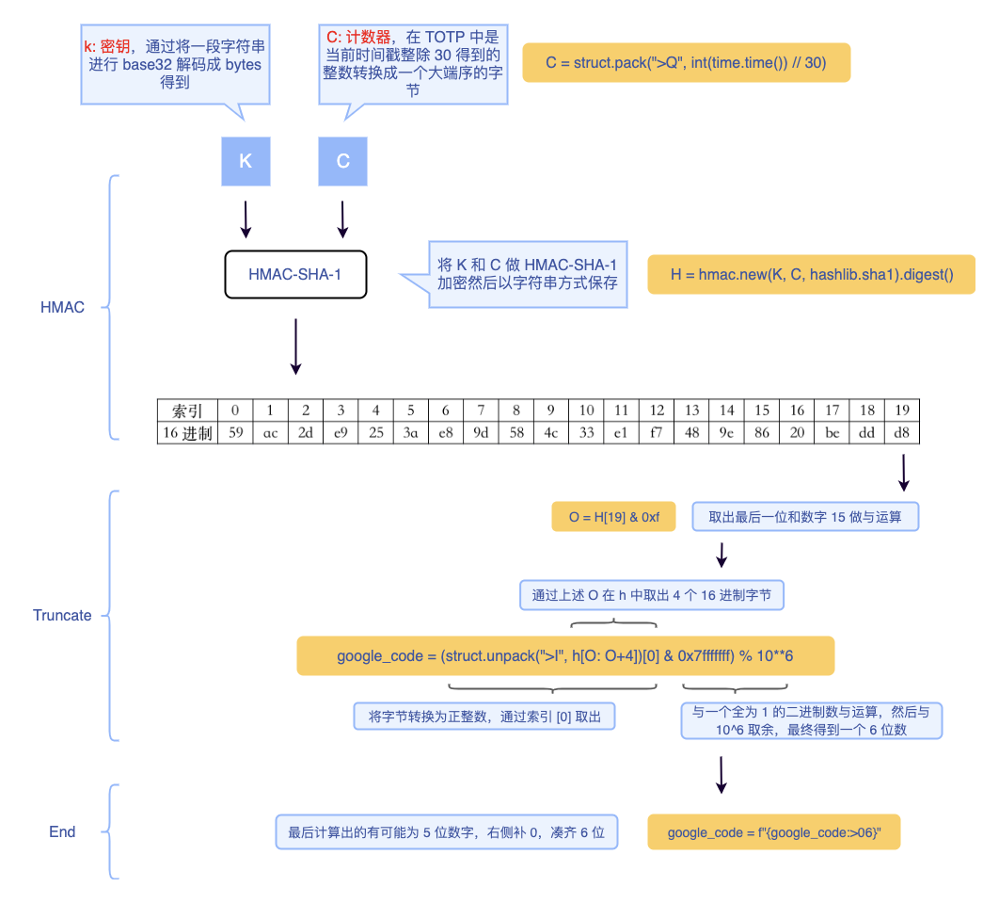

# Google Authenticator

# 简介

用户常常会在不同的网站使用相同的密码，一但一个网站账户的密码泄露，就会危及到其它使用相同密码的账户。为了解决这个问题，一些网站在登录时除了要求输入账户密码之外，还需要输入另一个一次性密码。例如银行常用的动态口令卡。


目前，大部分应用采用 [Google Authenticator](https://apps.apple.com/us/app/google-authenticator/id388497605)（谷歌身份认证）来生成认证令牌，只需要手机上安装一个APP，就可以生成一个不断变化的一次性密码，用于账户验证，而这个 APP 无需联网即可工作。

# 原理

## HOTP

Google的两步验证算法源自 `HMAC-Based One-Time Password` 算法，简称 HOTP。工作原理如下：

1. 客户端和服务器事先协商好一个密钥 K，用于标识用户；计数器 C，用于生成动态密码
2. 进行验证时，客户端对密钥和计数器的组合`(k,c)` 使用 HMAC 算法计算一次性密码，公式如下：
   
    ```bash
    HOTP(K,C) = Truncate(HMAC-SHA-1(K, C))
    ```
    

由于 HMAC 算法得出的值位数比较多，不方便用户输入，因此需要截短（truncate）成为一组不太长的十进制数（例如 6 位）。计算完成之后客户端计数器 C 计数值加 1，服务器端进行同样的计算，并与用户提交的数值进行比较，若一致则通过，服务器端将计数值增加 1。若不相同，则验证失败。

这里有一个问题，如果验证失败或者客户端不小心多进行了一次生成密码操作，那么服务器和客户端之间的计数器 C 将不再同步，因此需要有一个重新同步（Resynchronization）的机制。详情可参考 [RFC 4226]()

## TOTP

介绍完 HOTP，`TOTP (Time-based One-time Password)` 就容易理解了。TOTP 将 HOTP 中的计数器 C 用当前时间 T 来替代，于是就得到了随着时间变化的一次性密码。

虽然原理很简单，但是用时间来替代计数器会有一些特殊的问题，例如：

1. 时间 T 的值怎么选取?
   
    时间每时每刻都在变化，如果选择一个变化太快的 T ，那么用户来不及输入密码；如果选择一个变化太慢的 T ，那么第三方就有充足的时间来爆破一次性密码（6 位数字的密码仅有 10^6 种组合）；综合以上考虑，Google 采用了 30 秒作为时间片，T 的数组为从 Unix epoch（1990年 1 月 1 日 00:00:00）来经历的 30 秒的个数
    
2. 网络延时，用户输入延迟
   
    由于网络延时，用户输入延迟等因素，可能当服务器端接受到一次性密码时，T 的数值已经改变，这样就会导致验证失败。一个办法是，服务器计算当前时间片以及前面的 n 个时间片内的一次性密码值，只要其中有一个与用户输入的密码相同，则验证通过。当然，n 不能太大，否则会降低安全性。
    
    此外，如果我们知道客户端和服务器的时钟有所偏差，当服务器通过计算前 n 个时间片的密码并成功验证后，服务器就知道了客户端的时钟偏差。因此，下一次验证时，服务器就可以直接将偏差考虑在内进行计算。
    

# 实现



## 生成密钥

```python
def generate_secret(obj:str) -> tuple:
    """
    生成密钥
    
    :param obj: 生成密钥的字符串

    :returns: 
        secret: 字符串密钥, 用于生成二维码
        k     : base32解码的密钥, 用于 HMAC 签名
    """

    base32_obj = base64.b32encode(obj.encode())
    # 编码后的=, ios端 Authenticator 扫码时会出现问题, 此处将其全部转换为 A
    secret = base32_obj.decode().replace('=', 'A')
    k = base64.b32decode(secret)     
    return secret, k
```

## 计算时间片

```python
def generate_timestamp_bytestring():
    """
    生成字节时间片
    """
    
    ts = int(time.time()) // 30
    return struct.pack(">Q", ts
```

## HMAC-SHA1运算

```python
def truncate(hmac_hash:bytes) -> str:
    """
    将 hmac结果 转换为 6位数字
    """
    offset = hmac_hash[19] & 0xf
    google_code = (struct.unpack(">I", hmac_hash[offset: offset+4])[0] & 0x7fffffff) % 10**6
    # 若计算后结果不足6位, 则在左侧补0
    google_code = f'{google_code:>06}'
    return google_code

def generate_pwd(k:bytes, c:bytes) -> str:
    """
    生成 google 一次性密码
    
    :param k: base32解码的密钥
    :param c: 字节时间片

    :returns: 6位数字密码
    """
    hmac_hash = hmac.new(k, c, sha1).digest()
    google_pwd = truncate(hmac_hash)
    return google_pwd
```

## 生成二维码

```python
def generate_qrcode(secret:str, label:str=None, account:str=None) -> str:
    """
    生成 TOTP 配置 URI, 将其转换为二维码;
    可通过 Google Authenticator 扫码添加
    
    :param secret: 字符串密钥
    :param label: [可选]标识平台
    :param account: [可选]标识账号

    :returns: 二维码图片url
    """
    base_uri = 'otpauth://totp/{prefix}?{ends}'
    
    prefix = ''
    ends = {
        'secret': secret,
    }
    
    if label:
        prefix += label
        ends['issuer'] = label

    if account:
        prefix += f':{account}'
    
    totp_uri = base_uri.format(prefix=prefix, ends=urlencode(ends))
    # 草料二维码 api
    qrcode_url = f'https://api.pwmqr.com/qrcode/create/?url={quote(totp_uri)}'
    return qrcode_url
```

## 校验

- 在线校验: [https://rootprojects.org/authenticator/](https://rootprojects.org/authenticator/)
- APP 校验:
    - Android: [https://play.google.com/store/apps/details?id=com.google.android.apps.authenticator2&hl=en_US&gl=US](https://play.google.com/store/apps/details?id=com.google.android.apps.authenticator2&hl=en_US&gl=US)
    - Ios: [https://apps.apple.com/cn/app/google-authenticator/id388497605](https://apps.apple.com/cn/app/google-authenticator/id388497605)

# 使用

项目源码: https://github.com/zzzzls/python_authentiator

1. 使用 pip 安装
   
    ```python
    pip install python-authentiator
    ```
    
1. 使用
   
    ```python
    from python_authentiator import TOTP
    
    g_auth = TOTP(
        origin_secret='123456',
        label='demo',
        account='example@gmail.com'
    )
    
    # 生成密钥
    secret = g_auth.generate_secret()
    # 生成一次性密码
    print(g_auth.generate_code(secret))
    # 生成二维码
    print(g_auth.generate_qrcode(secret))
    ```
    

# 参考资料

1. **HOTP: An HMAC-Based One-Time Password Algorithm,**
   
    **RFC 4226:** [https://datatracker.ietf.org/doc/html/rfc4226](https://datatracker.ietf.org/doc/html/rfc4226)
    
2. **TOTP: Time-based One-time Password Algorithm**,
   
    **RFC Draft**: [https://tools.ietf.org/id/draft-mraihi-totp-timebased-06.html](https://tools.ietf.org/id/draft-mraihi-totp-timebased-06.html)
    
1. **Google Authenticator project:** https://github.com/google/google-authenticator
   
2. **Google账户两步验证的工作原理:** 
   
    IMCT: [https://blog.seetee.me/post/2011/google-two-step-verification/](https://blog.seetee.me/post/2011/google-two-step-verification/)
    
1. **Google Authenticator TOTP原理详解**
   
    [https://blog.51cto.com/xsboke/2363746](https://blog.51cto.com/xsboke/2363746)